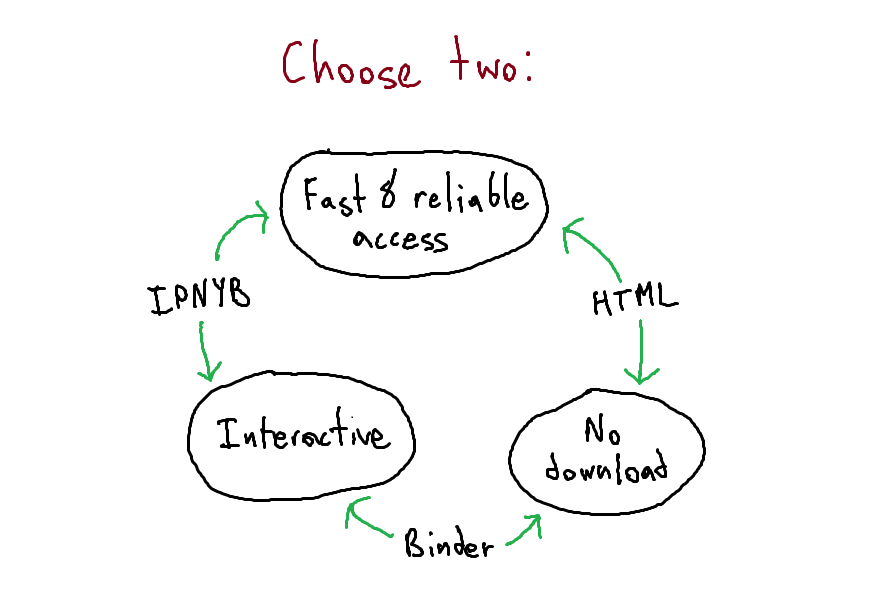

# Learn to Nim

!!work in progress, this currently does not work / is not fully functional!!

https://mybinder.org/v2/gh/White-Lizard1/learn_to_nim/main?labpath=nim.ipynb

The link above should take you to an interactive Jupyter notebook 

Welcome to the thrilling world of combinatorial game theory. Choose, of the three following methods of accessing the file, whichever one best suits you.

The simplest way to access is through Binder, which allows to you interact with the file in a brower, no setup needed. Downside: the website is slow and sometimes it completely fails to work. Good luck. https://mybinder.org/v2/gh/White-Lizard1/learn_to_nim/main?labpath=nim.ipynb

My preferred way, which should be simple enough for those who have experience with computers: download the file nim.ipnyb (**i**nteractive **py**thon **n**ote**b**ook), download [Jupyter notebook](https://jupyter.org/install), download [R 4.3.0](https://cran.r-project.org/bin/windows/base/old/4.3.0/), open R, and type the following lines of code to install IRkernel (so R works in Jupyter):

install.packages("IRkernel")
IRkernel::installspec(user = FALSE)

Then open command prompt, type in "jupyter notebook filepath" but replace filepath with the nim.ipnyb filepath. When it opens the notebook in your browser, select "Kernel" and change the kernel to R. If I didn't write this incorrectly it should work. 

The third option: If all else fails, you can always use the HTML version, which has the downside that you can't interact with the file (which means you can't play Nim, which slightly lowers the experience).

Unfortunately I could not find a way to make the file interactable, simple, and reliable at the same time. If you know a better option let me know.

FAQ down here for confused people:

(no one has been confused yet)
